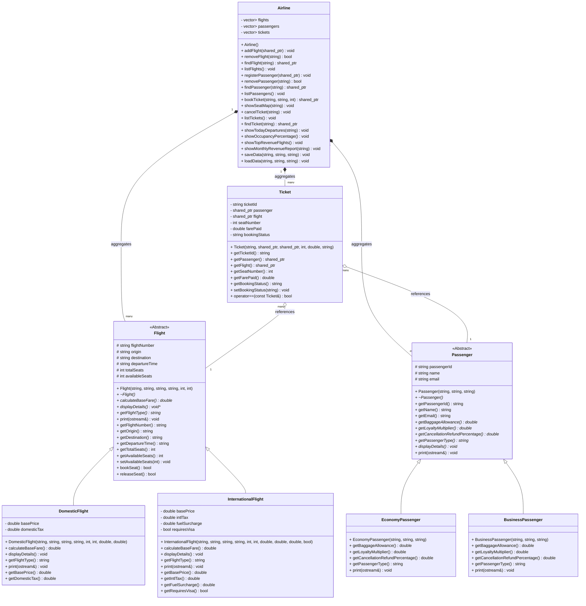

# SkyLink Airline Reservation & Flight Management System
## 🎓 Comprehensive Viva Preparation & Architectural Blueprint

This guide serves as an in-depth viva-ready preparation sheet, detailing every Object-Oriented Programming (OOP) construct, architectural decision, and simplified C++17 component utilized in the SkyLink framework.

---

## 🏗️ Part 1: Detailed OOP Principles Explained

### 1. Abstraction
* **Theory**: Exposing only the essential interface of an object while hiding its background complex implementation details. This reduces cognitive overhead and simplifies overall system design.
* **In SkyLink**:
  - The base class `Flight` is an abstract base class (ABC) representing a general flight. It defines pure virtual functions (`calculateBaseFare() = 0`, `displayDetails() = 0`, `getFlightType() = 0`), meaning you cannot instantiate `Flight` directly.
  - The system controller (`Airline`) manipulates flights using `std::shared_ptr<Flight>` pointers. It does not need to know the specific type of flight when calculating base fares or listing details.

### 2. Encapsulation
* **Theory**: Wrapping state (member variables) and behavior (member functions) into a single logical unit (class) and restricting direct access to the state via access specifiers (`private`/`protected`), exposing controlled modification via public getters and setters.
* **In SkyLink**:
  - All variables in `Flight`, `Passenger`, and `Ticket` are declared `private` or `protected`.
  - Properties like `availableSeats` in a flight cannot be randomly decremented or set to illegal states by other components; they must go through the public member functions `bookSeat()` and `releaseSeat()`, which strictly validate capacity constraints.
  - Constructor parameters are validated immediately. If a base price is negative or a name is blank, the constructor throws an `AirlineException` preventing the instantiation of malformed objects.

### 3. Inheritance
* **Theory**: Establishing an "is-a" relationship between a base class (parent) and a derived class (child), allowing the derived class to inherit common attributes and behaviors while implementing its specific properties, promoting code reusability.
* **In SkyLink**:
  - `Flight` acts as a parent for `DomesticFlight` and `InternationalFlight`.
  - `Passenger` acts as a parent for `EconomyPassenger` and `BusinessPassenger`.
  - This structure avoids code duplication. Common attributes (like `name`, `passengerId`, `email` in a passenger) are declared once in `Passenger` and inherited by all subclasses.

### 4. Runtime Polymorphism (Dynamic Binding)
* **Theory**: Enabling a single interface to behave differently depending on the actual runtime type of the object it points to. Dynamic binding is achieved in C++ through virtual member functions and virtual method tables (Vtables).
* **In SkyLink**:
  - Pointers of type `std::shared_ptr<Flight>` are stored in `std::vector<std::shared_ptr<Flight>>`.
  - When `flight->calculateBaseFare()` is invoked, the C++ runtime resolves the virtual call using the Vtable, calling `DomesticFlight::calculateBaseFare()` if it points to a domestic flight, or `InternationalFlight::calculateBaseFare()` for international ones.
  - **Virtual Destructors**: The virtual destructor `virtual ~Flight() = default;` is crucial. It ensures that when a base pointer `std::shared_ptr<Flight>` is deleted, the destructor of the derived class is also called, preventing resource leaks.

---

## 🏛️ Part 2: Justification of Classes & Architecture

### 1. Flight Sub-system Hierarchy
* **Flight**: Abstract base class defining general flight state (`flightNumber`, `origin`, `destination`, etc.).
* **DomesticFlight**: Inherits `Flight`. Adds domestic tax calculations.
* **InternationalFlight**: Inherits `Flight`. Adds international fuel surcharges, custom taxes, and visa requirement flags.
* *Why Inheritance?* Common states (flight number, route, capacity) are defined once in the base `Flight` class, making adding new flight categories trivial.
* *Why Virtual Functions?* Dynamic pricing logic requires that each flight compute its fare polymorphically at runtime during ticket booking.

### 2. Passenger Sub-system Hierarchy
* **Passenger**: Abstract base class defining common traveler state (`passengerId`, `name`, `email`).
* **EconomyPassenger**: Inherits `Passenger`. Sets 20kg baggage limit, 1.0x loyalty discount, and 50% refund policy.
* **BusinessPassenger**: Inherits `Passenger`. Sets 35kg baggage limit, 1.5x loyalty discount, and 75% refund policy.
* *Why Inheritance?* Allows storing any traveler type in a generic passenger collection while keeping class-specific baggage and cancellation refund rates encapsulated.
* *Why Virtual Functions?* Ensures cancellation refund percentages (`getCancellationRefundPercentage()`) are computed dynamically at runtime depending on the passenger's class type.

### 3. Ticket & The Rule of Zero
* **Ticket**: Links a `Passenger` to a `Flight`. Encapsulates the seat allocated, the fare paid, and active status.
* **Rule of Zero**: In modern C++, classes that only own standard library or smart pointer attributes should let the compiler auto-generate safe constructors, destructors, copy, and move operations. This is a premium industry standard that ensures memory safety without over-engineered boilerplate.
* **Friend Operators / Operator Overloading**:
  - `operator==` is overloaded to check if a passenger is already booked on the same flight, enforcing duplicate booking rejection.
  - `operator<<` is overloaded as a `friend` function in `Ticket`, `Flight`, and `Passenger` to support clean stream insertion. In `Flight` and `Passenger`, we implement virtual `print` functions called from inside the friend `operator<<`, representing a **polymorphic stream insertion pattern**.

### 4. Airline (Controller Class)
* Aggregates collections of `Flight`, `Passenger`, and `Ticket` objects using STL vectors. Provides API for booking, cancellation, seat map visualization, file serialization (saving/loading), and live business analytics.

---

## 🛠️ Part 3: Memory Safety, Templates, Exceptions, and Files

### 1. Smart Pointer Memory Safety
* We use `std::shared_ptr` to manage shared ownership of flights, passengers, and tickets.
* **Avoiding Circular References**: By looking up passenger travel history dynamically in `Airline` (scanning tickets matching the passenger ID), we completely eliminate reference cycle complexities (e.g. `Passenger` holding a `shared_ptr` to `Ticket` and vice-versa), ensuring flawless memory safety.

### 2. STL (Standard Template Library) & Templates
* **Containers**:
  - `std::vector`: The primary sequential container used for flights, passengers, and tickets due to its dynamic sizing and contiguous memory efficiency.
  - `std::map`: Used to aggregate sales keying off flight numbers in revenue reports.
* **Algorithms**:
  - `std::find_if`: Used to search lists using custom lambda predicates (e.g., finding flights by ID).
  - `std::sort`: Used to sort flight revenues in descending order for monthly revenue reports.
* **Generic Template Search Function**:
  - In `SearchTemplate.h`, we define a simple, highly clean template function:
    ```cpp
    template <typename T, typename Predicate>
    std::vector<std::shared_ptr<T>> searchItems(const std::vector<std::shared_ptr<T>>& items, Predicate pred);
    ```
    This utility leverages C++ templates, enabling reuse across flights, passengers, or tickets with simple lambdas.

### 3. Custom Exceptions
* Satisfying the university OOP exception handling requirements, we implement a single, unified custom exception class `AirlineException` (derived from `std::exception`). This is easy to defend in a viva and handles all flight-full, duplicate bookings, database failures, and validation errors.

### 4. File Handling & Serialization
* Data is stored in plaintext files (`flights.txt`, `passengers.txt`, `tickets.txt`) inside `data/`.
* When saving, the polymorphic types are downcast using `std::dynamic_pointer_cast` to retrieve derived-specific fields.
* When loading, the type prefix token (e.g. `Domestic`) is parsed to construct the appropriate subclass.

---

## 📊 Part 4: Mermaid UML Class Diagram



---

## 💬 Part 5: 16 Viva Questions with Top-Scoring Answers

#### Q1: What is the main difference between a Virtual Function and a Pure Virtual Function?
> **Answer**: A virtual function has a default implementation in the base class and can be optionally overridden in derived classes. A pure virtual function is declared with `= 0` at the end, has no implementation in the base class, and **must** be overridden by non-abstract derived classes.

#### Q2: What is an Abstract Class? Can we instantiate it?
> **Answer**: An abstract class is a class that contains at least one pure virtual function. It cannot be instantiated (we cannot create an object of this class). However, we can create pointers and references of its type to achieve runtime polymorphism.

#### Q3: Why is the destructor in your `Flight` base class declared `virtual`?
> **Answer**: If we delete a derived class object through a base class pointer and the destructor is not virtual, only the base class destructor will execute. The derived class destructor will be bypassed, resulting in resource leaks. Declaring it virtual ensures the derived class destructor runs first, followed by the base class destructor.

#### Q4: Explain the difference between `std::shared_ptr` and raw pointers.
> **Answer**: A raw pointer (`T*`) requires manual memory management (`new` and `delete`), which is prone to memory leaks and dangling pointers. `std::shared_ptr<T>` is a smart pointer that implements reference counting. It automatically deletes the managed object when the last `std::shared_ptr` pointing to it goes out of scope.

#### Q5: How did you implement duplicate booking prevention?
> **Answer**: I overloaded the `operator==` in the `Ticket` class. When a booking request is made, `Airline::bookTicket` constructs a temporary ticket and scans the tickets collection. If a match is found (same passenger on same flight), the system throws an `AirlineException`.

#### Q6: What is the VTable and VPtr? How is polymorphism resolved?
> **Answer**: Every class with virtual functions has a Virtual Table (VTable), which is a static array of function pointers. Every object of that class contains a hidden pointer called `vptr` pointing to the VTable. When a virtual function is called at runtime, the compiler follows `vptr` to resolve the function address dynamically.

#### Q7: Why did you use `std::dynamic_pointer_cast` in `saveData()`?
> **Answer**: When writing flights to disk, we must save derived-specific attributes (like fuel surcharges for international flights). Since they are stored as base pointers (`std::shared_ptr<Flight>`), we use `std::dynamic_pointer_cast` to safely downcast the pointer to the derived class type at runtime.

#### Q8: Explain what a Lambda function is and where you used it.
> **Answer**: A lambda function is an anonymous inline function. I used lambdas in combination with standard algorithms like `std::find_if` and inside my custom `searchItems` template to define the search filtering predicate directly at the call site.

#### Q9: What is exception safety? How does your system guarantee it?
> **Answer**: Exception safety ensures that when an error occurs and an exception is thrown, the system doesn't leak memory or leave the program in an inconsistent state. Since we use `std::shared_ptr` (RAII) and robust try-catch blocks, our system naturally avoids memory leaks even when exceptions are thrown.

#### Q10: Why is `std::vector` preferred over standard arrays?
> **Answer**: Vector is a dynamic container that handles resizing automatically, manages memory under the hood, provides bounds checking via `at()`, and keeps elements contiguous in memory, ensuring CPU cache friendliness and fast access.

#### Q11: Explain how the generic search template works in your system.
> **Answer**: The generic `searchItems` template takes a `std::vector<std::shared_ptr<T>>` along with a unary predicate function or lambda. It iterates through the vector and returns a new vector containing pointers that satisfy the predicate. This is a very clean and modern C++17 design.

#### Q12: How are files parsed during data loading?
> **Answer**: We read files line by line using `std::getline` and split them using a delimiter (`|`). The first token determines the type (e.g. `Economy`). Based on this type token, we call the appropriate constructor to instantiate the correct derived object.

#### Q13: What does the `noexcept` specifier mean? Where is it used?
> **Answer**: The `noexcept` specifier tells the compiler that a function will not throw an exception. It is used in custom exceptions on the overridden `const char* what() const noexcept` method to guarantee standard-compliant exception messages.

#### Q14: How does encapsulation protect system integrity?
> **Answer**: By marking variables like `availableSeats` as `protected` and exposing `bookSeat()` as a public method, we prevent outside classes from illegally modifying seat counts without performing proper capacity checks.

#### Q15: What is the advantage of utilizing `std::make_shared` over `new`?
> **Answer**: `std::make_shared` performs a single memory allocation for both the control block (reference count) and the managed object, whereas `new` requires two separate allocations. It is faster and improves memory locality.

#### Q16: What is the "Rule of Zero" and how does it apply to your system?
> **Answer**: The Rule of Zero states that classes that do not manage manual raw resources should not define custom destructors, copy/move constructors, or copy/move assignment operators. Since the `Ticket` class uses modern types (`std::string`, `std::shared_ptr`), we let the compiler auto-generate these functions, reducing boilerplate code and preventing bugs.
